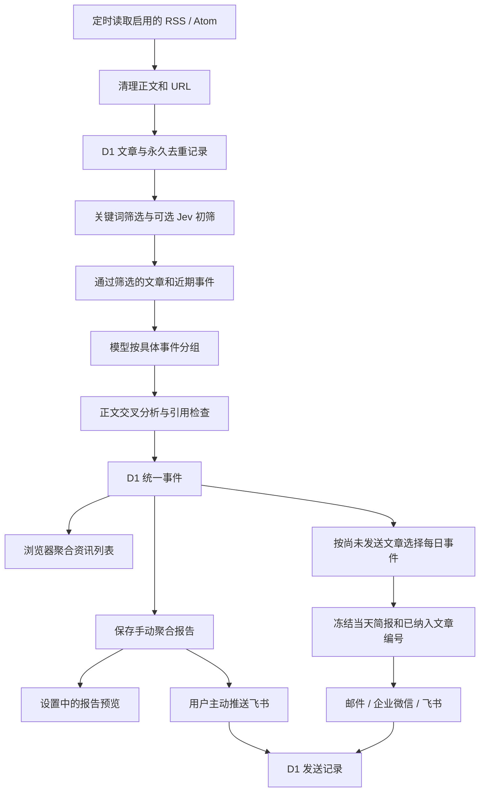

# 灵析的核心架构

Cloudflare Worker 负责采集、分析和发送，D1 保存来源、文章、事件、简报和任务记录。浏览器读取聚合事件与配置，按已保存偏好筛选资讯；解析与确认保存分开，保存不会触发采集。收藏只存标识到当前浏览器。来源、机器人状态和手动报告放在设置弹窗，正文只通过原文链接打开。

## 模块如何配合

| 模块 | 做什么 |
| --- | --- |
| `lib/automation/feeds.ts` | 校验来源地址，解析 RSS/Atom，清理正文和跟踪参数。 |
| `lib/automation/store.ts`、`db/schema.ts`、`drizzle/` | 保存文章、事件、发送队列、历史记录和任务锁。 |
| `lib/roundup.ts`、`lib/automation/digest.ts` | 将明确的多主题早报单独保留，其他文章由模型按具体事件分组，检查 ID 是否完整且不重复。 |
| `lib/automation/policy.ts`、`screening.ts`、`jev.ts` | 解析搜集要求，先匹配关键词，再调用 Jev 判断阅读价值并保存筛选结果。 |
| `lib/automation/meter.ts` | 按阶段记录服务返回的 Token 用量，缺少统计时保留未知状态。 |
| `lib/automation/events.ts` | 比较新报道和近期事件，分析正文，保存统一事件，并把这些事件排成每日简报。 |
| `lib/analyze.ts` | 调用模型，检查正文引文、评分与推荐文章 ID；提供八类分析结果。 |
| `lib/automation/selection.ts`、`lib/automation/runner.ts` | 选择已经分析的内容，未完成文章继续排队；有内容时冻结简报并发送，保留等待、错误和渠道结果。 |
| `lib/automation/manual-report.ts` | 固定一次手动报告的文章范围，分批处理、保存进度，并在同一报告上继续汇总。 |
| `lib/automation/delivery.ts` | 调用邮件、企业微信与飞书接口，判断结果与不确定状态。 |
| `lib/automation/api.ts` | 检查管理员口令，提供配置、事件读取、分组修正与任务接口。 |
| `app/page.tsx`、`components/feed-workspace.tsx`、`lib/client-feed.ts` | 并行读取事件与设置，管理连接、偏好过滤、发布时间排序和仅存标识的收藏。 |
| `components/feed-preferences.tsx`、`components/feed-item.tsx` | 展示解析前后变更、确认保存，以及摘要、来源和分析依据。 |
| `components/feed-dialog.tsx`、`components/feed-settings.tsx`、`components/report-body.tsx` | 弹窗管理推送与来源，按需检查新资讯、生成报告与显式推送。 |
| `lib/automation/presentation.ts` | 区分等待、生成和发送状态，支持选择历史记录。 |
| `lib/event-state.ts` | 文章集合改变时，清除旧分析和推荐。 |
| `build/sites-worker.ts` | 提供页面、API 与 scheduled 定时入口。 |
| `scripts/verify-sources.mjs` | 用真实来源验证采集、重复入库和事件处理，正文写入忽略目录。 |

## 文章怎样变成事件和简报

文章去重与事件分组分别处理：相同来源重复返回同一 ID、清理后的 URL 或相同正文，不再次入库；不同来源相同正文仍保留来源归属，分析时只提交一份正文并标记转载没有新增信息。不同正文交给模型比较，不能仅凭关键词认定为重复。

设置中点击“检查新资讯并分析”时，先采集入库，再分析已有文章并保存报告，生成步骤不重复采集、不自动发送。首页刷新只读取数据，确认保存偏好只写策略。点击推送时只发送指定报告编号对应的正文，不受每日开关和时间限制。接口与限制集中维护在[自动订阅与推送](docs/automation.md)。

手动报告和每日任务共享 `reading_events`。新手动报告固定文章范围，用户可分批继续更新尚未完成的报告；已完成或已发送的正文不会被后台自动改写。阶段和数量保存在报告详情，浏览器轮询只读进度接口。旧版报告仍保留生成时的结果。分组修正接口仍保留，前端当前没有文章管理页。旧浏览器数据不删除；新收藏使用独立版本键，不读取旧收藏、已读或调试数据。策略与推送配置仍为站点共用，未实现多用户独立设置。

## 关键技术选择

| 技术 | 为什么使用 |
| --- | --- |
| React 19、TypeScript、Vinext/Vite | 提供阅读交互、检查字段，并构建 Cloudflare Worker。 |
| Cloudflare Workers、D1 | 页面和后台使用同一个运行环境；文章与事件不依赖开发电脑保存。 |
| fast-xml-parser | 解析 RSS/Atom，配合大小限制和实体检查处理不可信内容。 |
| Jev 的 System One HTTP API | 批量提出 Score 问题，依据分数和把握程度决定是否进一步分析。 |
| Chat Completions 与 JSON mode | 通过兼容接口调用模型；当前用户指定 DeepSeek Flash。 |
| 页面内存 | 只保留本次管理口令与操作状态，报告和设置从 D1 读取。 |
| localStorage | 收藏只保存事件与成员文章 ID，用于当前浏览器恢复，不同步到服务端。 |
| Node.js 测试、SQLite、GitHub Actions | 检查实际 SQL、模型结果规则与重复任务行为，并验证构建。 |

业务模块直接使用 D1，Drizzle 管理数据库结构与部署迁移；初始 R2 和 connector 示例尚未参与正式处理。配置、容量和失败规则见[自动订阅与推送](docs/automation.md)。模型没有联网事实核查能力，多个来源提及仍不等于独立证实。

搜集规则、筛选缓存、分析复用和用量统计的具体行为见[搜集要求与模型开销](docs/collection-policy.md)。
