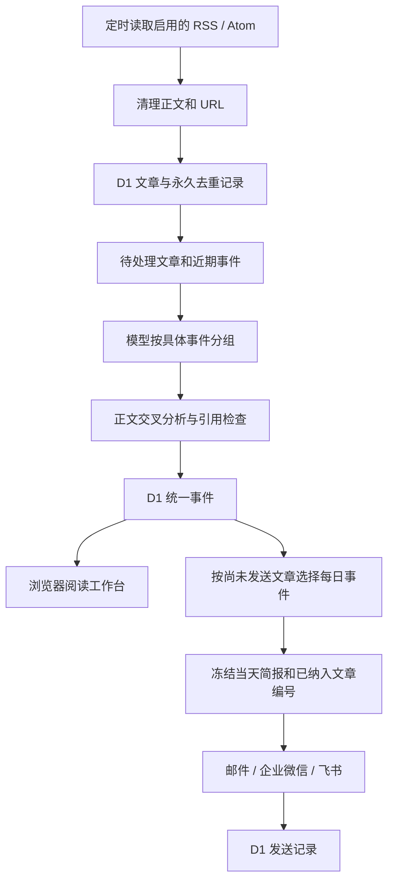

# 灵析的核心架构

Cloudflare Worker 负责采集、分析和发送，D1 保存来源、文章、事件、简报和任务记录。浏览器读取后台事件，提供筛选、阅读、收藏和分组修正。手动导入仅作为调试工具，仍使用浏览器存储，不参与正式每日简报。

## 模块如何配合

| 模块 | 做什么 |
| --- | --- |
| `lib/automation/feeds.ts` | 校验来源地址，解析 RSS/Atom，清理正文和跟踪参数。 |
| `lib/automation/store.ts`、`db/schema.ts`、`drizzle/` | 保存文章、事件、发送队列、历史记录和任务锁。 |
| `lib/roundup.ts`、`lib/automation/digest.ts` | 将明确的多主题早报单独保留，其他文章由模型按具体事件分组，检查 ID 是否完整且不重复。 |
| `lib/automation/events.ts` | 比较新报道和近期事件，分析正文，保存统一事件，并把这些事件排成每日简报。 |
| `lib/analyze.ts` | 调用模型，检查正文引文、评分与推荐文章 ID；提供八类分析结果。 |
| `lib/automation/selection.ts`、`lib/automation/runner.ts` | 选择已经分析的内容，未完成文章继续排队；有内容时冻结简报并发送，保留等待、错误和渠道结果。 |
| `lib/automation/delivery.ts` | 调用邮件、企业微信与飞书接口，判断结果与不确定状态。 |
| `lib/automation/api.ts` | 检查管理员口令，提供配置、事件读取、分组修正与任务接口。 |
| `components/automatic-reader.tsx`、`app/page.tsx` | 读取后台事件，展示文章与分析；收藏和已读仍保存在当前浏览器。 |
| `components/automation-panel.tsx`、`lib/automation/presentation.ts` | 将简报、来源和推送设置分开，区分等待、生成与发送状态；预览与正式记录分别查看。 |
| `lib/event-state.ts` | 文章集合改变时，清除旧分析和推荐。 |
| `build/sites-worker.ts` | 提供页面、API 与 scheduled 定时入口。 |
| `scripts/verify-sources.mjs` | 用真实来源验证采集、重复入库和事件处理，正文写入忽略目录。 |

## 文章怎样变成事件和简报

文章去重与事件分组分别处理：相同来源重复返回同一 ID、清理后的 URL 或相同正文，不再次入库；不同来源相同正文仍保留来源归属，分析时只提交一份正文并标记转载没有新增信息。不同正文交给模型比较，不能仅凭关键词认定为重复。

用户点击“检查新文章”时，只走采集和入库流程，并保存待分析事件供工作台查看，响应不等待 LLM。定时任务和预览继续执行分组与分析；管理页从 D1 读取文章总数、待分析数量与采集记录，避免把新增 0 篇误解为采集失败。

阅读与每日推送共享 `reading_events`，不另存一套简报分析。正式简报是事件在发送时的固定文本快照；后来新报道或人工修正不会改写已经发送的消息。浏览器修正分组会保存到 D1，两个新分组都清除旧分析，并阻止后台自动再次合并。

## 关键技术选择

| 技术 | 为什么使用 |
| --- | --- |
| React 19、TypeScript、Vinext/Vite | 提供阅读交互、检查字段，并构建 Cloudflare Worker。 |
| Cloudflare Workers、D1 | 页面和后台使用同一个运行环境；文章与事件不依赖开发电脑保存。 |
| fast-xml-parser | 解析 RSS/Atom，配合大小限制和实体检查处理不可信内容。 |
| Chat Completions 与 JSON mode | 通过兼容接口调用模型；当前用户指定 DeepSeek Flash。 |
| localStorage | 只用于浏览器阅读偏好、收藏、已读和调试数据。 |
| Node.js 测试、SQLite、GitHub Actions | 检查实际 SQL、模型结果规则与重复任务行为，并验证构建。 |

业务模块直接使用 D1，Drizzle 管理数据库结构与部署迁移；初始 R2 和 connector 示例尚未参与正式处理。配置、容量和失败规则见[自动订阅与推送](docs/automation.md)。模型没有联网事实核查能力，多个来源提及仍不等于独立证实。
