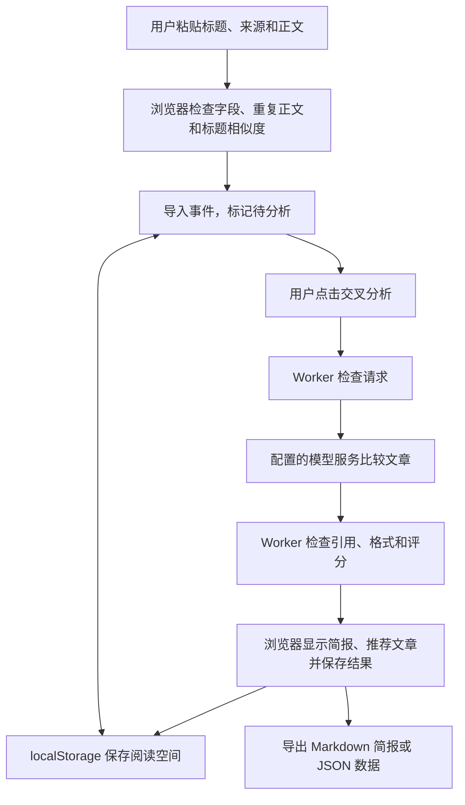

# 灵析的核心架构

当前应用由浏览器工作台、Cloudflare Worker 和用户配置的模型服务组成。浏览器保存文章和阅读状态；Worker 接收分析请求、调用模型并检查返回结果。服务端没有保存文章的数据库，也没有后台采集任务。

## 模块如何配合

| 文件或目录 | 做什么 |
| --- | --- |
| `app/page.tsx` | 管理工作台、文章导入、标题分组、筛选、阅读室、本地保存和导出；发起分析请求并显示结果。 |
| `lib/data.ts` | 定义文章、事件和事实等数据类型，提供虚构的演示事件与来源。 |
| `lib/analyze.ts` | 检查请求字段，调用模型，检查引用和评分格式，重新计算综合分，并返回 JSON。 |
| `build/sites-worker.ts` | 将分析与状态接口交给分析模块，其余请求交给 Vinext；保留平台 connector（外部服务连接）上下文。 |
| `app/layout.tsx`、`app/globals.css` | 提供页面布局、元信息与工作台样式。 |
| `vite.config.ts`、`scripts/` | 配置本地开发、依赖安装和 Worker 构建。 |
| `tests/analysis.test.mjs`、`.github/workflows/ci.yml` | 检查分析规则；在 GitHub 推送和 PR 中运行类型检查、测试与构建。 |

`components/ui/`、`db/`、`examples/d1/`、connector 工具和 `app/chatgpt-auth.ts` 保留了初始项目提供的组件与接入示例。当前阅读流程没有使用数据库、账号登录或 connector 自动采集。文件存在不代表相应产品功能已经接通。

## 数据流和处理流程

1. 用户手动提供正文。原文链接只供读者打开，应用不会抓取链接内容。
2. 浏览器拒绝完全相同的正文，比较标题，把可能讨论同一事件的文章放到一起。这个过程没有调用模型，也没有使用向量检索。
3. 用户点击分析时，浏览器把该事件的文章发到 `/api/analyze`。Worker 检查请求来源、格式和大小后，将正文交给模型服务。
4. 模型判断这些文章是否属于同一事件，并生成摘要、事实、观点和逐篇评价。Worker 拒绝不符合规则的结果，检查引用原句，再计算综合分。
5. 成功后，浏览器更新事件和文章评分，并选择综合分最高的文章。失败时显示错误，不生成替代的虚构分析。

具体分组算法、接口格式、评分权重和实现限制只在[实现说明](docs/implementation.md)中维护。

## 关键技术选型

| 技术 | 在项目中的用法与原因 |
| --- | --- |
| React 19、TypeScript | React 管理工作台交互，TypeScript 描述文章和分析结果，便于检查前后端字段。 |
| Vinext、Vite | 用 Next App Router 风格组织页面，通过 Vite 开发并构建。脚本实际调用 Vinext/Vite，而不是 `next dev` 或 `next build`。 |
| Cloudflare Workers、Wrangler | 使用同一个 Worker 提供页面和分析接口；Wrangler 在本地模拟运行环境。 |
| CSS、Tailwind CSS 4、Lucide | 定义工作台布局、样式和图标。 |
| localStorage | 当前单浏览器版本无需数据库即可保存阅读空间；它不提供账号隔离或设备同步。 |
| `fetch`、Chat Completions、JSON mode | 通过兼容接口调用模型，不依赖某个厂商 SDK；模型服务需要满足[配置说明](docs/configuration.md)中的接口要求。 |
| Node.js 内置测试、GitHub Actions | 对分析模块做确定性的校验测试，并在每次推送后检查项目能否通过类型检查和构建。 |

框架与工具的准确版本以 `package.json` 和 `package-lock.json` 为准，文档不重复列出所有依赖版本。

## 当前范围与后续扩展

当前应用只比较用户提供的文章，不查询官方材料或外部数据。引用原句存在、多个来源说法一致，都不能证明事件已经被独立证实。

如果以后增加自动采集，需要另行实现来源授权、正文清理、文章去重、事件判断和任务重试。如果增加账号或跨设备同步，需要设计用户隔离和服务端存储。现有 D1、R2 和 connector 示例可以作为接入起点；当前 `.openai/hosting.json` 没有启用 D1 或 R2，`db/schema.ts` 也没有业务表。
